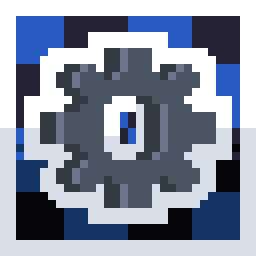

# VEng2
###### ( Actually, it is Veng3, but the first version had a different name )
### What is this ??
This is my third attempt at creating my own engine **for my future game**

### What is the project idea ??
The core idea behind this engine is complete customization via modules and extensive modding of games built on it
###### ( but to cut the bullshit, I’m just fucking around )
It is worth noting that **I am no programming genius** ; this project is best viewed simply as a work in which I present **my vision** of an ideal engine

### Which of my own modules I use ??

-  

    Used for **scripting** via [LuaJIT](https://github.com/luajit/luajit)  and its FFI

-  

    A **utility pack.** containing common code used in my projects

### Which third-party modules am I using? ??

-  

  It will be used for **rendering** until the [rSDL](https://github.com/lololoh2004/raysdl2)  is written ( which will take a long time )

-   ( and the corresponding **binding** )

-  

- And **oooothes..** ( if I add a library and forget to specify it )

<table width="100%">
  <tr bgcolor="#2b2214">
    <td style="padding: 15px; border-left: 5px solid #d29922; color: #e6edf3;">
      ⚠️ <strong>WARNING: </strong> This project is NOT UNDER ACTIVE DEVELOPMENT due to the creationof separate modules such as rSDL, MSWLua, LoUtils, and others
    </td>
  </tr>
</table>

  
Honorable mention

  

    
  

